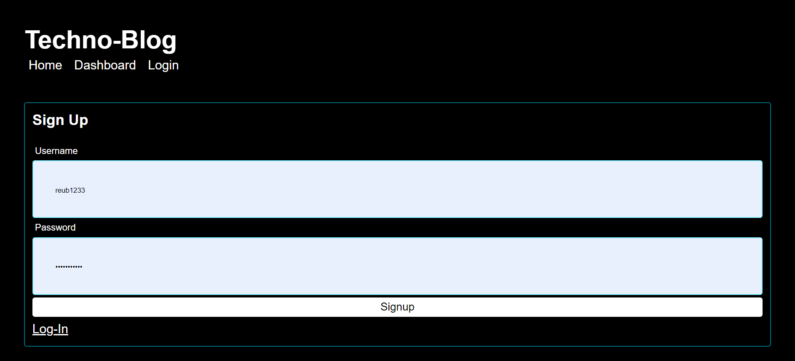

# MVC-techBlog

Tech blog that includes sign in, page states, and dynamic site elements. Sequalize was used in order to better control the sql database, 
and page states were used in order to control what content was being passed in using handlebars to dynamically render content. The site
contains a sign in, log in, profile, and home pages. The sign in and log in both test to make sure the password meets length requirments, 
and the usernames for the sign up cannot be an already existing username. The profile page has all of the users posts, and the home page has all user posts.

## Screenshots

## Technologies
Handlebars
Node
Express
Javascript
HTML
CSS
bcrypt
Express-session
Sequelize ndoe package
SQL

## Contributors
Greg D'Amato